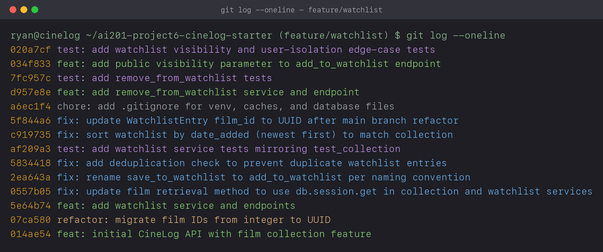

# PR Response Doc — CineLog Watchlist Feature

## AI Usage
I used an AI assistant to move faster, but I checked everything it told me against the actual code before trusting it.

- Getting oriented: I had it summarize `models.py`, `collection_service.py`, and `test_collection.py` so I could see the naming conventions and how dedup and the tests work before reading the review comments. I then confirmed the important parts myself, e.g. that `add_to_collection` does a `filter_by(...).first()` check and raises `AlreadyInCollectionError`.
- Comment 2: I asked it to explain what `add_to_collection`'s dedup check does and what happens when the film doesn't exist, then wrote the watchlist version myself instead of having it generate the code.
- Comment 3: I asked what pattern the collection tests follow and what fixtures I'd need, then wrote `test_watchlist.py` by hand.
- Comments 4 and 5: after I'd drafted both positions, I asked it to argue against me: what would a picky reviewer push back on, and what tradeoff was I skipping. For Comment 4 it pointed out I hadn't named the privacy-by-default principle directly, so I rewrote that part and added the condition that would make me change my mind. For Comment 5 it raised the long-list lookup case for alphabetical order, which I already leaned against but wrote a proper answer to (the `?sort=` idea).
- I also had it double-check my `git log` against the conventional commit format.

The arguments below are mine. Where the AI actually changed something I wrote, I said so above.

## Comment 1 — Rename
**What I did:** Renamed `save_to_watchlist()` to `add_to_watchlist()` in [services/watchlist_service.py](services/watchlist_service.py) so it lines up with the rest of the services (collection already uses `add_to_collection`). There was one call site to update in [routes/watchlist/watchlist.py](routes/watchlist/watchlist.py): the import and the call inside `add_film()`.

**How I verified:** I ran `grep -rn "save_to_watchlist" --include="*.py" .` first, which showed three hits (the definition plus the import and call in the route). After the rename the same grep came back empty, so nothing was left pointing at the old name. Tests still passed and the app imported fine.

## Comment 2 — Deduplication
**What I did:** I copied the approach `add_to_collection()` already uses. It defines `AlreadyInCollectionError`, and after checking the film exists it runs `CollectionEntry.query.filter_by(user_id=..., film_id=...).first()` and raises if there's already a row. I did the same in [services/watchlist_service.py](services/watchlist_service.py): added `AlreadyInWatchlistError` and a matching check in `add_to_watchlist()` before it creates the entry. I also updated the route to return 409 for `AlreadyInWatchlistError` and 404 for `FilmNotFoundError`, the way the collection route does, so a duplicate comes back as a clean 409 instead of a 500.

One difference worth flagging: `CollectionEntry` also has a `UniqueConstraint(user_id, film_id)` at the DB level, and `WatchlistEntry` doesn't. I kept the dedup in the service since that's what the comment was about, and left adding a DB constraint as a possible follow-up.

**How I verified:** I ran a quick throwaway script that added a film, added it again, and checked that `AlreadyInWatchlistError` was raised and only one row existed (count == 1). It also confirmed a made-up `film_id` raises `FilmNotFoundError`. Then I turned that into a real test (`test_add_to_watchlist_duplicate_raises` in [tests/test_watchlist.py](tests/test_watchlist.py)). Full suite passes.

## Comment 3 — Missing test
**What I did:** Added [tests/test_watchlist.py](tests/test_watchlist.py) based on [tests/test_collection.py](tests/test_collection.py). I reused the same three fixtures (`app` on in-memory SQLite, `sample_user`, `sample_film`) and the same style of assertions. The test the comment asked for is `test_add_to_watchlist_nonexistent_film_raises`, which is the watchlist copy of `test_add_to_collection_nonexistent_film_raises`: it passes a `film_id` that isn't in the DB and checks for `FilmNotFoundError`. I added `test_add_to_watchlist_creates_entry` and `test_add_to_watchlist_duplicate_raises` too so the file covers the same ground as the collection tests.

**How I verified:** `pytest tests/test_watchlist.py -v` passed all three, and `pytest tests/ -v` passed 7 (4 collection + 3 watchlist) so nothing else broke.

## Comment 4 — Default visibility
**My position:** Keep `public=True` as the default.

**Reasoning:** A watchlist is a list of films you want to see. It's forward-looking and pretty low-stakes, and it's not the same as your collection, which is basically your viewing history and says a lot more about you. The whole point of CineLog being social is people seeing what their friends are into, getting recommendations, and planning to watch things together, and a watchlist is exactly the kind of thing that feeds that. Letterboxd, for one, keeps watchlists public. Most people never touch defaults, so if the default were private the social side of the feature would mostly sit empty. The `public` flag is also per-entry, so if there's one film someone doesn't want showing up, they can mark just that one private without hiding the whole list.

**Tradeoff acknowledged:** The real argument for `public=False` is privacy-by-default: you shouldn't expose someone's data unless they actually opted in, and since most people never change the setting, the default basically is the choice for them. That's fair, and someone who thinks of their watchlist as private planning could get caught off guard. So my answer assumes two things: the app makes it clear at add-time (and during signup) that watchlists are public, and the per-entry toggle is actually in the UI. If CineLog were aimed at a more privacy-sensitive crowd, like minors, I'd flip the default to private. It's the audience that would change my mind, not the code.

## Comment 5 — Sort order
**My position:** I went with the maintainer's suggestion and changed `get_watchlist()` to sort by `date_added` descending (newest first) instead of alphabetically by title.

**Reasoning:** Two reasons. First, `get_collection()` already sorts newest-first (`order_by(CollectionEntry.date_added.desc())`) and has a test pinning that. Having the two list endpoints sort differently is just confusing for anyone using both. Second, a watchlist is really a queue of stuff you mean to get to, so "what did I just add" and "what's next" are the usual questions, and those are about recency, not the alphabet.

**Engagement with reviewer's point:** I agree with the maintainer on date-added, and the existing collection behavior is what tipped it, so this is mostly about matching a pattern that's already there. That said, alphabetical isn't pointless: on a long watchlist with hundreds of films it's much easier to scan for one title you're looking for, and newest-first isn't. My take is that the fix for that is a sort option (something like `?sort=title|date_added`) rather than making everyone use alphabetical by default. I left that as a follow-up so this PR stays focused. Also worth noting that newest-first only adds new entries at the top, it doesn't reorder the ones already there.

## Comment 6 — Rebase
**What conflicted:** I ran `git fetch origin` then `git rebase origin/main`, and it finished with no merge-conflict markers at all, which was the confusing part. The `WatchlistEntry` model actually lives in the shared root commit (`014ae54`), not in any of my commits, so none of my commits touch `models.py`. The refactor on main (`07ca580`) did two things there: switched `Film.id` and `CollectionEntry.film_id` from `Integer` to `String(36)` UUIDs, and deleted `WatchlistEntry` entirely (watchlist doesn't exist on main). Since my commits don't change `models.py`, git had nothing to merge and just kept main's copy, which meant the watchlist code was importing a `WatchlistEntry` that no longer existed. So the break was semantic, not a text conflict: `from models import WatchlistEntry` threw `ImportError`, and the old model's `film_id` was an integer while everything else had moved to UUIDs.

**How I resolved it:** I added `WatchlistEntry` back to `models.py`, following the shape of `CollectionEntry` after the refactor: `id` and `user_id` as `String(36)`, `public` defaulting to `True`, and `film_id = db.Column(db.String(36), db.ForeignKey("film.id"))` so it's a UUID like the rest of the schema. I also fixed the leftover `film_id (int)` note in the `add_to_watchlist()` docstring and the `"film_id": <int>` example in the route.

**How I verified:** `git log --oneline --merges origin/main..HEAD` was empty, so the branch is linear with no merge commits. `python -c "from models import WatchlistEntry"` imported fine and `pytest tests/ -v` passed all 8. I also ran the actual endpoints with UUID film ids: `POST /watchlist/<uuid>/add` gave 201, a repeat gave 409, an unknown id gave 404, and `GET /watchlist/<uuid>` gave 200 with films newest-first.

## Stretch Features
I also did the three stretch features.

**1. `remove_from_watchlist(user_id, film_id)`** — added to [services/watchlist_service.py](services/watchlist_service.py), following `remove_from_collection()` exactly: look up the entry with `filter_by(user_id=..., film_id=...).first()`, raise a new `NotInWatchlistError` if it isn't there, otherwise delete and commit. I also added the matching `DELETE /watchlist/<user_id>/remove` route, which returns 200 on success and 404 (mapped from `NotInWatchlistError`) if the film isn't on the list, same shape as the collection remove route. Tests: `test_remove_from_watchlist_deletes_entry` and `test_remove_from_watchlist_not_present_raises` in [tests/test_watchlist.py](tests/test_watchlist.py).

**2. Extra test (my choice): `test_watchlist_is_isolated_per_user`.** I picked user isolation because both `get_watchlist()` and the dedup check in `add_to_watchlist()` filter on `user_id`, and nothing in the review covered that boundary. If either query ever dropped the `user_id` filter, one user could see or block another user's entries, which is a quiet but serious bug. The test confirms adding a film for one user leaves another user's watchlist empty, and that the same film can be added independently for a second user (dedup is per-user, not global).

**3. Visibility toggle.** `add_to_watchlist()` now takes `public=True` as a parameter, and the `POST /add` route reads it from the body (`data.get("public", True)`), so a caller can send `{"film_id": "...", "public": false}` to add a film privately instead of relying on the default. The default stays `True` to match the Comment 4 decision. Test: `test_add_to_watchlist_respects_public_false` checks both that `public=False` is stored and that omitting it still defaults to public.

## PR Description

### What this feature does
Adds a watchlist to CineLog, a per-user list of films someone wants to watch (separate from the collection, which is films they've already watched). Endpoints under the `/watchlist` blueprint:

- `POST /watchlist/<user_id>/add` with body `{ "film_id": "<uuid>", "public": true }` (`public` optional, defaults to true). Adds a film. Returns 201 with the new entry, 404 if the film doesn't exist, and 409 if it's already on the watchlist.
- `GET /watchlist/<user_id>` returns the watchlist as a list of film dicts (with `date_added` and `public`), newest first.
- `DELETE /watchlist/<user_id>/remove` with body `{ "film_id": "<uuid>" }`. Removes a film. Returns 200 on success, 404 if it isn't on the list. (Stretch feature.)

It's backed by a `WatchlistEntry` model (`user_id`, `film_id` as UUID, `date_added`, `public`) and `add_to_watchlist` / `remove_from_watchlist` / `get_watchlist`, which follow the same conventions as the collection service (verb_to_noun names, dedup in the service, `FilmNotFoundError` / `AlreadyInWatchlistError` / `NotInWatchlistError`).

### Design decisions
1. Default visibility (`public=True`). New entries are public by default because a watchlist is low-stakes, forward-looking content and the point of the platform is sharing it, and because most people never change defaults. There's a per-entry `public` flag for marking individual films private. Tradeoff: this goes against privacy-by-default, so it assumes the public nature is made clear at add-time, and I'd flip it for a privacy-sensitive audience. (More in Comment 4.)
2. Sort order (`date_added`, newest first). `get_watchlist` sorts newest-first to match `get_collection` and because a watchlist is a recency-driven queue. Tradeoff: alphabetical is better for finding a known title in a long list, so the real fix there is a `?sort=` option rather than changing the default. (More in Comment 5.)

### How to test manually
```bash
# Set up
python -m venv .venv && source .venv/bin/activate
pip install -r requirements.txt

# Run the tests (12 of them)
pytest tests/ -v

# Start the app
python app.py            # http://127.0.0.1:5000 (no frontend, so 404 at / is expected)
```
Films use UUIDs now, so create a user and a film first (e.g. in a Python REPL with the app context) and grab their ids, then:
```bash
USER=<user-uuid>
FILM=<film-uuid>

# Add a film -> 201
curl -s -X POST localhost:5000/watchlist/$USER/add -H 'Content-Type: application/json' -d "{\"film_id\": \"$FILM\"}"

# Add it again -> 409 (dedup)
curl -s -X POST localhost:5000/watchlist/$USER/add -H 'Content-Type: application/json' -d "{\"film_id\": \"$FILM\"}"

# Add a film that doesn't exist -> 404
curl -s -X POST localhost:5000/watchlist/$USER/add -H 'Content-Type: application/json' -d '{"film_id": "does-not-exist"}'

# Add a film privately (public=false) -> 201, entry shows "public": false
curl -s -X POST localhost:5000/watchlist/$USER/add -H 'Content-Type: application/json' -d "{\"film_id\": \"$FILM\", \"public\": false}"

# View the watchlist -> 200, newest first
curl -s localhost:5000/watchlist/$USER

# Remove a film -> 200; removing it again -> 404
curl -s -X DELETE localhost:5000/watchlist/$USER/remove -H 'Content-Type: application/json' -d "{\"film_id\": \"$FILM\"}"
```
The first add returns 201, the duplicate returns 409 with an "already on this user's watchlist" message, the unknown id returns 404, the private add returns 201 with `"public": false`, the GET lists films most-recently-added first, and the DELETE returns 200 (then 404 if you remove the same film again).

---

## Commit history
Screenshot of `git log --oneline` on `feature/watchlist`:



Same thing as text:

```
020a7cf test: add watchlist visibility and user-isolation edge-case tests
034f833 feat: add public visibility parameter to add_to_watchlist endpoint
7fc957c test: add remove_from_watchlist tests
d957e8e feat: add remove_from_watchlist service and endpoint
a6ec1f4 chore: add .gitignore for venv, caches, and database files
5f844a6 fix: update WatchlistEntry film_id to UUID after main branch refactor
c919735 fix: sort watchlist by date_added (newest first) to match collection
af209a3 test: add watchlist service tests mirroring test_collection
5834418 fix: add deduplication check to prevent duplicate watchlist entries
2ea643a fix: rename save_to_watchlist to add_to_watchlist per naming convention
0557b05 fix: update film retrieval method to use db.session.get in collection and watchlist services
5e64b74 feat: add watchlist service and endpoints
07ca580 refactor: migrate film IDs from integer to UUID   <- main
014ae54 feat: initial CineLog API with film collection feature
```

There are 13 commits on top of `main` (`feat` x3 / `fix` x5 / `test` x3 / `chore` / `docs`). They're all in conventional format, each does one thing, and the branch is linear (`git log --oneline --merges origin/main..HEAD` is empty, so no merge commits). The last four commits above `chore:` are the stretch features (remove endpoint, its tests, the visibility parameter, and the extra edge-case tests). The one commit not visible in the image is the `docs:` commit that adds this file, since a commit can't contain a screenshot of itself; it sits on top of the `test:` commit shown at the top.
